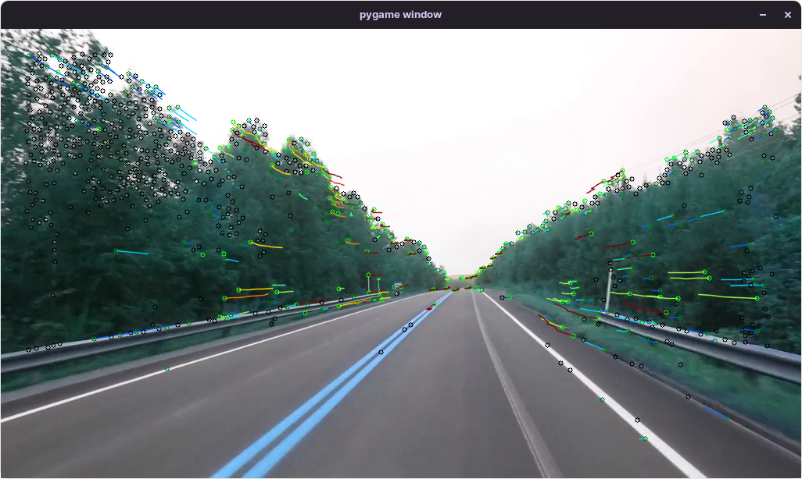
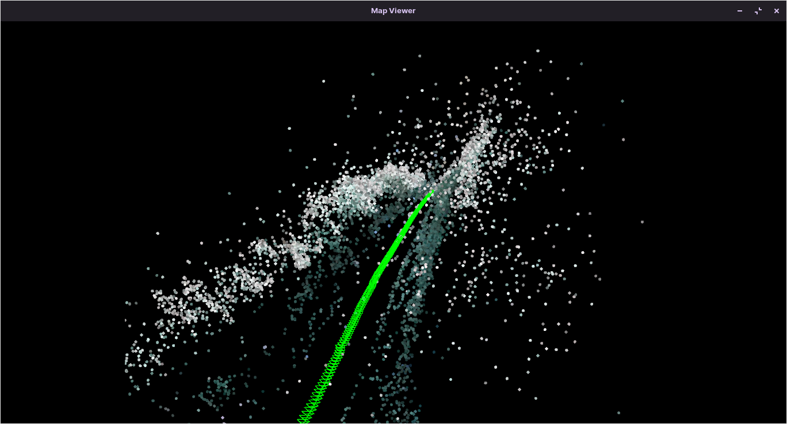

# Vslam-monocular-RGB
An open source mapping and localisation framework for autonomous vehicles using monocular RGB cameras 
  
  


### Prerequisites
* Pangolin(data visualization)https://github.com/rakesh-i/pangolin
* g20py(optimization)https://github.com/rakesh-i/g2opy

### Usage
```
F=984 ./slam.py videos/test_kitti984.mp4
F=550 ./slam.py videos/test_nyc.mp4
```
